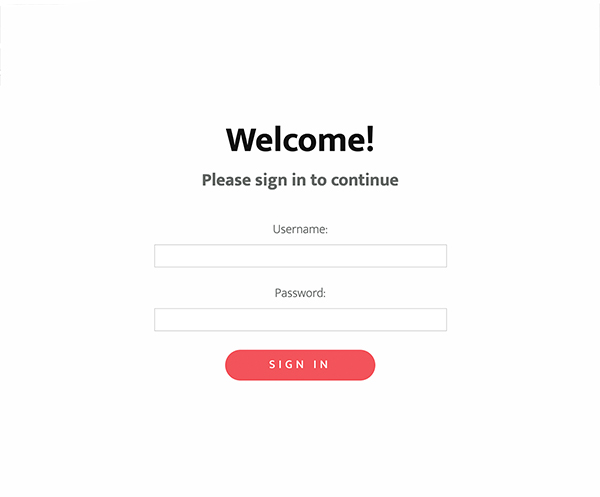
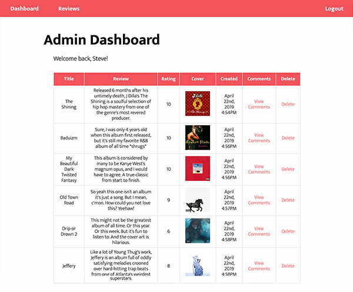
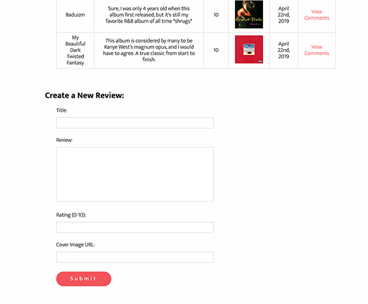

# php-mysql-review-site
A music review website using PHP and MySQL where users can create, submit and comment on reviews.

### Login.php

On this site users are first met with a [login page](login.php). If a user tries to access any other page before logging in, they will be redirected here. There are two user types: _reviewer_ and _admin_. Whether or not a user is logged in and which user type they are is tracked using the _SESSION_ superglobal variable in PHP.

Usernames and passwords are stored in the MySql database and use md5 encryption. The tables are selected using prepared statements to avoid SQL injection attacks.

## Admin.php

After login, users are directed to the user [dashboard](admin.php).

If the user is an _admin_, the dashboard will show a table populated by all reviews that are stored in the database. The table will also contain a delete row with a link to delete the corresponding review from the database. If clicked, the user will be shown a [confirmation page](delete.php) with the selected review before actually deleting it from the database.

If the user is a _reviewer_, the dashboard will show a table containing only the current user's published reviews. Below the table is a form where the user may submit a new review. Once submitted, the information is stored in the database and also in [reviews.xml](reviews.xml) for RSS syndication.
 

## Reviews.php

[This page](reviews.php) shows a list of all reviews stored in the database. When the user clicks the name of a review, that review's id is passed using a query string.

## Review.php

After selecting a review the user will be directed to the [review](review.php) page. Using the query string stored in PHP's _GET_ superglobal array the review's data is selected from the MySql table and shown on the screen.
